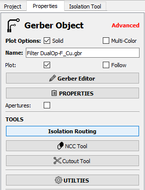
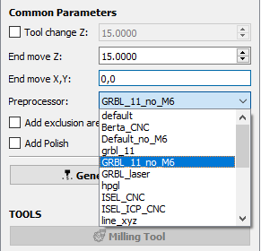
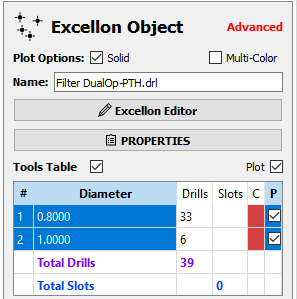
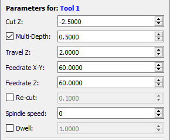
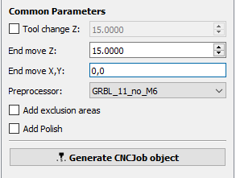

# FlatCAM
## Installing Tools Database
* First download the [Tools_Data_Base.TXT](../FlatCam_Tools_Database/Tools_Data_Base.TXT) file by clicking the link and click download raw file. 

* Under the "Options" tab or use the "Ctrl + D" shortcut or go  to open the Tools Database. You may create a new tool here, but it is recommended to import the database provided in this repository. Select "Import DB" and select the [Tools_Data_Base.TXT](../FlatCam_Tools_Database/Tools_Data_Base.TXT) file to import the tools database.

## Opening Gerber and Excellon Files
* In FlatCAM, open the Gerber and the Excellon files to add them to the FlatCAM project.

  

* These objects may be placed far from the origin, so select all using the "Ctrl + A" shortcut, and Move to Origin using the "Shift + O" shortcut. It is important to select all objects to move them as a group, otherwise the drill objects will not be aligned to the contour objects.

  

## Generating Isolation Routing GCode with an End-Mill

* Double-click the Gerber object in the project tree side panel, then select "Isolation Routing".

  

* Right click the #1 tool in the Tools Table and delete it. We will be using a tool from the tools database.

  

* Select "Pick from DB" in the sidebar, select the "End-Mill_0.3mm" or "End-Mill_0.4mm" tool, depending on clearances the PCB was designed with. Next select "Transfer the Tool" to apply to the Isolation Tool operation.

* Then click "Generate Geometry"

* In "Common Parameters" change the End move X,Y to 0,0

* Then change the Preprocessor to "GRBL_11_no_M6", followed by "Generate CNCJob Object".

  

* The contour job is complete, select "Save CNC Code" or right click the CNC Job in the project tree side panel to save the Gcode for access with Candle later.

## Generating Drill GCode using Milling Option

* The drill job can now be created. This operation may vary depending on your requirements. For example, the provided design uses two different size vias, and these can either be combined into one or retained as two different drill operations. Depending on drill bit availability and prototyping requirements, you may opt to simplify this operation to use the smallest size drill, otherwise it is recommended to use the Tool Change option to provide for drill changing.

* Double click the Excellon drill file in the project tree side panel, and select all the holes to drill in this operation. For example, all the holes will be in the same drill operation. 

  

  

* Then select the "UTILITES" button, then change the Milling Diameter to 0.5 and click the "Mill Drills"

* Adjust Cut Z to a value of -2.5mm. Check "Multi-Depth" and change it to 0.5mm. It is recommended to reduce Feedrate X-Y to 60 (120 may be too high and could cause damage to the end mill). If using the provided fixture, there will be ample clearance under the board.

  

* In the "Common Parameters" section, change "End Move X,Y" to 0,0. Then change the "Preprocessor" to "GRBL_11_no_M6" and go back up to the "Parameters" section and re-select the "Multi-Depth" setting.

  

* Select "Generate CNCJob Object" and save in the same manner as the contour operation. 

These G-code files may be opened directly in Candle for heightmap generation and running of the machine.

Next Tutorial: [Using Candle](./using_Candle.md)
